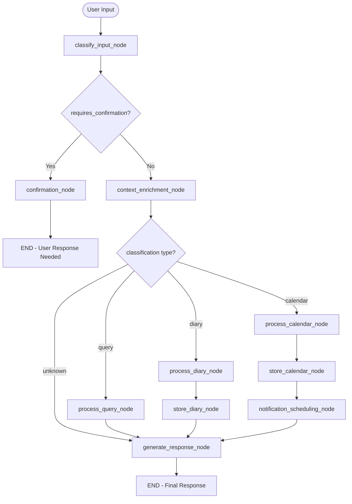

# LangGraph Agent Workflow Documentation

This directory contains the LangGraph-powered AI agent workflow for the Calendar Assistant. The agent intelligently classifies user input and routes it through appropriate processing pipelines.

## 📊 Graph Architecture Overview

The LangGraph agent workflow is structured as a **decision tree with conditional routing** that processes user messages through multiple stages to determine whether input should be stored as diary entries, calendar events, or answered as queries.

## 🔄 Agent Workflow Structure



## 🗂️ File Structure

```
langgraph_workflows/
├── __init__.py           # AgentState schema definition
├── nodes.py             # All node implementations
├── agent_workflow.py    # Main workflow graph construction
└── README.md           # This documentation
```

## 📋 State Management

### AgentState Schema

The workflow uses a TypedDict to manage state throughout the graph:

```python
class AgentState(TypedDict):
    user_id: str                    # User identification
    session_id: str                 # Conversation grouping
    user_input: str                 # Original message
    classification: str             # diary/calendar/query
    extracted_datetime: Optional[datetime]  # Parsed time info
    timezone: str                   # User timezone
    processed_content: str          # Cleaned/formatted content
    storage_result: str             # Database operation result
    agent_response: str             # Final response to user
    confidence_score: float         # Classification confidence (0.0-1.0)
    requires_confirmation: bool     # Low confidence flag
```

## 🎯 Workflow Stages

### 1. Entry Point: Classification

**Node: `classify_input_node`**
- **Purpose**: Determines message type using GPT-4 analysis
- **Process**: 
  - Analyzes temporal indicators (past/future tense)
  - Checks for question words vs statements
  - Considers user timezone context
- **Confidence Scoring**: Based on keyword presence and language patterns
- **Output**: Sets `classification`, `confidence_score`, `requires_confirmation`

**Classification Types:**
- `diary`: Personal reflections, experiences, past events
- `calendar`: Future events, appointments, scheduling
- `query`: Questions about past/future data

### 2. Confidence Check & Routing

**High Confidence (>0.7)**: Proceeds to context enrichment
**Low Confidence (<0.7)**: Routes to confirmation node → END

```python
def route_after_classification(state: AgentState):
    if state.get("requires_confirmation", False):
        return "confirmation"  # Requires user clarification
    else:
        return "context_enrichment"  # Continue processing
```

### 3. Context Enrichment

**Node: `context_enrichment_node`**
- **Purpose**: Adds user history context for better processing
- **Data Sources**:
  - Recent diary entries (last 5)
  - Upcoming calendar events (next 5)
  - User timezone and preferences
- **Enhancement**: Improves downstream processing accuracy

### 4. Type-Specific Processing

#### Branch A: Diary Processing
```
process_diary_node → store_diary_node → generate_response_node → END
```

**`process_diary_node`:**
- Extracts date mentions from content
- Cleans and formats text
- Prepares for diary storage

**`store_diary_node`:**
- Creates DiaryEntry database record
- Links to user and extracted date
- Handles storage errors gracefully

#### Branch B: Calendar Processing
```
process_calendar_node → store_calendar_node → notification_scheduling_node → generate_response_node → END
```

**`process_calendar_node`:**
- Uses GPT-4 to extract event details
- Parses title, description, datetime, duration
- Handles timezone conversion

**`store_calendar_node`:**
- Creates CalendarEvent database record
- Sets default duration (60 minutes)
- Configures reminder settings

**`notification_scheduling_node`:**
- Framework for push notification scheduling
- Calculates reminder times (15 minutes before)
- Prepares notification payload

#### Branch C: Query Processing
```
process_query_node → generate_response_node → END
```

**`process_query_node`:**
- Searches user's diary entries and calendar events
- Uses semantic matching on content
- Generates contextual responses based on found data

### 5. Response Generation

**Node: `generate_response_node`**
- **Purpose**: Creates user-friendly confirmation messages
- **Responses**:
  - Diary: "✓ Saved to your diary for [date]"
  - Calendar: "✓ Added to calendar: [event] at [time]"
  - Query: Formatted search results or helpful suggestions

## 🔀 Routing Logic

### Conditional Edge Patterns

1. **Classification Confidence**:
   ```python
   classify_input → confidence_check → confirmation OR context_enrichment
   ```

2. **Processing Type**:
   ```python
   context_enrichment → classification_type → appropriate_processor
   ```

3. **Storage Needs**:
   ```python
   process_* → storage_required → store_* OR generate_response
   ```

4. **Post-Storage Actions**:
   ```python
   store_calendar → notification_scheduling → generate_response
   store_diary → generate_response
   ```

### Smart Routing Features

- **Early Exit**: Low confidence requests immediate user feedback
- **Type Specialization**: Each classification gets tailored processing
- **Storage Optimization**: Queries skip storage, events get notifications
- **Error Resilience**: Unknown classifications gracefully fallback

## 🧠 AI Integration

### OpenAI GPT-4 Usage

**Classification Node:**
```python
classification_prompt = f"""
Analyze the following user input and classify it into one of three categories:
1. "diary" - Personal reflections, experiences, things that happened
2. "calendar" - Future events, appointments, reminders, scheduling  
3. "query" - Questions about past events or future plans

User timezone: {timezone}
User input: "{user_input}"

Respond with ONLY the classification: diary, calendar, or query
"""
```

**Calendar Processing:**
```python
extraction_prompt = f"""
Extract event details from this text: "{user_input}"

Provide:
- Title: (brief event title)
- Description: (additional details)
- DateTime: (when should this occur, timezone: {timezone})
- Duration: (estimated minutes, default 60)
"""
```

### Confidence Calculation

```python
def calculate_classification_confidence(user_input: str, classification: str) -> float:
    diary_indicators = ["today", "yesterday", "had", "went", "did", "was", "felt"]
    calendar_indicators = ["tomorrow", "next", "schedule", "meeting", "remind"]  
    query_indicators = ["what", "when", "where", "how", "did i", "show me"]
    
    # Score based on indicator presence + base confidence
    return min(indicator_score + 0.5, 1.0)
```

## 🔧 Implementation Details

### Node Function Signature

All nodes follow this pattern:
```python
def node_name(state: AgentState) -> AgentState:
    """
    Process state and return updated state
    """
    # Process logic here
    state["updated_field"] = new_value
    return state
```

### Error Handling

- **Database Errors**: Captured and stored in `storage_result`
- **AI Processing Errors**: Graceful fallbacks with error messages
- **Invalid Classifications**: Default to response generation
- **DateTime Parsing**: Fallback to current time + offset

### Performance Considerations

- **Stateless Nodes**: No shared state between executions
- **Database Connections**: Managed per operation, not persistent
- **AI Calls**: Minimal and focused prompts
- **Early Termination**: Confirmation requests exit immediately

## 🚀 Usage Examples

### Starting the Workflow

```python
from .agent_workflow import agent_workflow
from . import AgentState

initial_state: AgentState = {
    "user_id": str(user.id),
    "session_id": str(session_id),
    "user_input": "Had lunch with Sarah today",
    "classification": "",
    "timezone": "UTC",
    # ... other fields initialized
}

result = await agent_workflow.ainvoke(initial_state)
response = result["agent_response"]
```

### Example Flows

**Diary Entry:**
```
Input: "Had a great meeting today"
→ classify_input (confidence: 0.8, classification: "diary")
→ context_enrichment
→ process_diary
→ store_diary
→ generate_response: "✓ Saved to your diary for December 15, 2024"
```

**Calendar Event:**
```
Input: "Meeting with client tomorrow 3pm"  
→ classify_input (confidence: 0.9, classification: "calendar")
→ context_enrichment
→ process_calendar
→ store_calendar
→ notification_scheduling
→ generate_response: "✓ Added to calendar: Client meeting, December 16, 2024 at 3:00 PM"
```

**Query:**
```
Input: "What did I do yesterday?"
→ classify_input (confidence: 0.8, classification: "query")
→ context_enrichment  
→ process_query
→ generate_response: "Yesterday you had: [list of diary entries and events]"
```

**Low Confidence:**
```
Input: "Sarah"
→ classify_input (confidence: 0.3, classification: "diary")
→ confirmation: "I'm not sure how to classify 'Sarah'. Should I save it as a diary entry, add to calendar, or answer as a question?"
→ END (awaits user clarification)
```

## 🔄 Future Enhancements

### Planned Improvements

1. **Multi-turn Conversations**: Handle follow-up questions and clarifications
2. **Intent Chaining**: Link related diary entries and calendar events
3. **Smart Suggestions**: Proactive event and diary prompts
4. **Learning Adaptation**: Improve classification based on user corrections
5. **Parallel Processing**: Execute independent nodes concurrently
6. **Caching Layer**: Cache frequent AI responses and user patterns

### Mobile App Integration

The workflow is designed for seamless mobile integration:
- **Async Support**: All nodes support async execution
- **Stateless Design**: Enables horizontal scaling
- **Error Recovery**: Graceful handling of network issues
- **Offline Queue**: Framework for processing queued messages

## 📚 References

- **LangGraph Documentation**: [https://langchain-ai.github.io/langgraph/](https://langchain-ai.github.io/langgraph/)
- **StateGraph API**: Core graph construction patterns
- **Conditional Edges**: Dynamic routing based on state
- **Node Implementation**: Stateless function patterns

---

**Last Updated**: December 2024  
**Version**: 1.0.0  
**Maintainer**: Calendar Assistant Team 