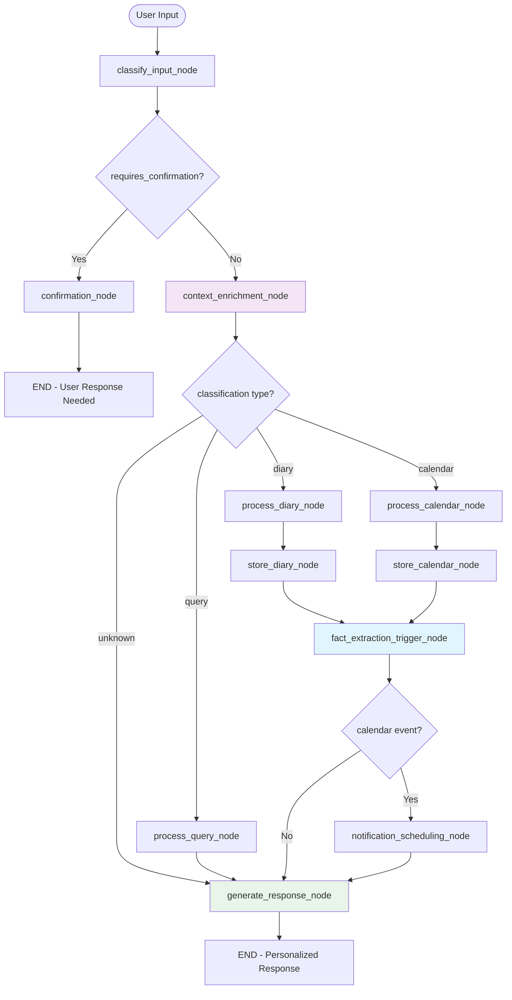

# LangGraph Agent Workflow Documentation - Enhanced with Long-Term Memory

This directory contains the LangGraph-powered AI agent workflow for the Calendar Assistant. The agent intelligently classifies user input and routes it through appropriate processing pipelines, **now enhanced with advanced long-term memory capabilities** that learn and remember personal facts about each user for increasingly personalized interactions.

## 📊 Graph Architecture Overview

The LangGraph agent workflow is structured as a **decision tree with conditional routing** that processes user messages through multiple stages to determine whether input should be stored as diary entries, calendar events, or answered as queries.

## 🔄 Agent Workflow Structure



## 🗂️ File Structure

```
langgraph_workflows/
├── __init__.py           # AgentState schema definition
├── nodes.py             # All node implementations
├── agent_workflow.py    # Main workflow graph construction
└── README.md           # This documentation
```

## 📋 State Management

### Enhanced AgentState Schema

The workflow uses a TypedDict to manage state throughout the graph, **now enhanced with long-term memory fields**:

```python
class AgentState(TypedDict):
    # Core workflow fields
    user_id: str                    # User identification
    session_id: str                 # Conversation grouping
    user_input: str                 # Original message
    classification: str             # diary/calendar/query
    extracted_datetime: Optional[datetime]  # Parsed time info
    timezone: str                   # User timezone
    processed_content: str          # Cleaned/formatted content
    storage_result: str             # Database operation result
    agent_response: str             # Final response to user
    confidence_score: float         # Classification confidence (0.0-1.0)
    requires_confirmation: bool     # Low confidence flag
    
    # Long-term memory fields (NEW)
    user_facts: List[Dict[str, Any]]  # Retrieved relevant personal facts
    fact_context: str               # Formatted context from user facts
    personalization_enabled: bool   # Whether personalization is active
```

## 🎯 Workflow Stages

### 1. Entry Point: Classification

**Node: `classify_input_node`**
- **Purpose**: Determines message type using GPT-4 analysis
- **Process**: 
  - Analyzes temporal indicators (past/future tense)
  - Checks for question words vs statements
  - Considers user timezone context
- **Confidence Scoring**: Based on keyword presence and language patterns
- **Output**: Sets `classification`, `confidence_score`, `requires_confirmation`

**Classification Types:**
- `diary`: Personal reflections, experiences, past events
- `calendar`: Future events, appointments, scheduling
- `query`: Questions about past/future data

### 2. Confidence Check & Routing

**High Confidence (>0.7)**: Proceeds to context enrichment
**Low Confidence (<0.7)**: Routes to confirmation node → END

```python
def route_after_classification(state: AgentState):
    if state.get("requires_confirmation", False):
        return "confirmation"  # Requires user clarification
    else:
        return "context_enrichment"  # Continue processing
```

### 3. Enhanced Context Enrichment with Long-Term Memory

**Node: `context_enrichment_node`** (Now Enhanced with Personal Facts)
- **Purpose**: Adds user history context AND relevant personal facts for personalized processing
- **Data Sources**:
  - Recent diary entries (last 5)
  - Upcoming calendar events (next 5)
  - **Personal facts retrieved via vector similarity search** (NEW)
  - User timezone and preferences
- **Long-Term Memory Integration**:
  - Semantic search through user's encrypted personal facts
  - Retrieval of contextually relevant facts (preferences, habits, personal info)
  - Population of `user_facts`, `fact_context`, and `personalization_enabled` fields
- **Enhancement**: Dramatically improves downstream processing with personalized context

### 4. Type-Specific Processing

#### Branch A: Enhanced Diary Processing
```
process_diary_node → store_diary_node → fact_extraction_trigger_node → generate_response_node → END
```

**`process_diary_node`:**
- Extracts date mentions from content
- Cleans and formats text with personalized context
- Prepares for diary storage

**`store_diary_node`:**
- Creates DiaryEntry database record
- Links to user and extracted date
- Handles storage errors gracefully

#### Branch B: Enhanced Calendar Processing
```
process_calendar_node → store_calendar_node → fact_extraction_trigger_node → notification_scheduling_node → generate_response_node → END
```

**`process_calendar_node`:**
- Uses GPT-4 to extract event details with personal context
- Parses title, description, datetime, duration
- Handles timezone conversion
- Considers user preferences for timing and scheduling

**`store_calendar_node`:**
- Creates CalendarEvent database record
- Sets default duration (60 minutes)
- Configures reminder settings

**`fact_extraction_trigger_node`:** (NEW - Long-Term Memory)
- **Purpose**: Triggers background AI analysis to extract personal facts from conversations
- **Process**:
  - Analyzes user input and agent response for extractable facts
  - Queues GPT-4 powered fact extraction for 4 categories:
    - **Personal**: Name, age, family, location, habits
    - **Preference**: Food, activities, communication style, timing
    - **Work**: Job, company, schedule, skills, projects
    - **Health**: Conditions, medications, allergies, fitness (encrypted)
  - Only extracts facts with >70% confidence
  - Prevents duplicate fact storage through smart merging
- **Background Processing**: Uses Celery for async fact extraction to maintain chat responsiveness

**`notification_scheduling_node`:**
- Framework for push notification scheduling
- Calculates reminder times (15 minutes before)
- Prepares notification payload
- Considers user's preferred notification patterns (if learned)

#### Branch C: Query Processing
```
process_query_node → generate_response_node → END
```

**`process_query_node`:**
- Searches user's diary entries and calendar events
- Uses semantic matching on content
- Generates contextual responses based on found data

### 5. Enhanced Personalized Response Generation

**Node: `generate_response_node`** (Now AI-Powered with Personal Context)
- **Purpose**: Creates personalized, context-aware confirmation messages using learned user facts
- **Personalization Process**:
  - Checks if `personalization_enabled` is true (user has stored facts)
  - Uses `fact_context` to enhance responses with personal touches
  - Employs GPT-4 to naturally weave in relevant personal facts
- **Standard Responses**:
  - Diary: "✓ Saved to your diary for [date]"
  - Calendar: "✓ Added to calendar: [event] at [time]"
  - Query: Formatted search results or helpful suggestions
- **Personalized Response Examples**:
  - Diary: "✓ Saved to your diary for December 15th. I noticed you usually reflect on work meetings - this adds to your professional growth pattern!"
  - Calendar: "✓ Added to calendar: Client meeting tomorrow at 3pm. Perfect timing since you prefer afternoon meetings and usually have better focus then."
  - Query: "Based on your vegetarian preferences, here are the lunch meetings from last week where you mentioned plant-based options..."

## 🔀 Routing Logic

### Conditional Edge Patterns

1. **Classification Confidence**:
   ```python
   classify_input → confidence_check → confirmation OR context_enrichment
   ```

2. **Processing Type**:
   ```python
   context_enrichment → classification_type → appropriate_processor
   ```

3. **Storage Needs**:
   ```python
   process_* → storage_required → store_* OR generate_response
   ```

4. **Fact Extraction Routing** (NEW):
   ```python
   store_* → fact_extraction_trigger → calendar_check → notification OR response
   ```

5. **Post-Storage Actions**:
   ```python
   store_calendar → fact_extraction_trigger → notification_scheduling → generate_response
   store_diary → fact_extraction_trigger → generate_response
   ```

### Smart Routing Features

- **Early Exit**: Low confidence requests immediate user feedback
- **Type Specialization**: Each classification gets tailored processing
- **Storage Optimization**: Queries skip storage, events get notifications
- **Error Resilience**: Unknown classifications gracefully fallback

## 🧠 Long-Term Memory Integration (NEW)

### Personal Fact Extraction

The workflow now includes sophisticated fact extraction capabilities that analyze every conversation to learn personal details about users:

#### Fact Categories & Examples
- **Personal Facts**: "My name is Sarah", "I live in Seattle", "I have two cats", "I work from home on Fridays"
- **Preference Facts**: "I'm vegetarian", "I prefer morning meetings", "I like yoga for relaxation", "I don't like phone calls after 6pm"
- **Work Facts**: "I'm a Software Engineer at TechCorp", "I have standup every Monday", "My manager is Alex", "I'm working on the mobile app project"
- **Health Facts** (Encrypted): "I'm allergic to peanuts", "I take medication at 8am", "I have a dentist appointment monthly"

#### Vector-Based Fact Retrieval
```python
def get_user_context(user_input: str, user_id: str) -> dict:
    """
    Retrieve relevant facts using semantic similarity:
    1. Generate embedding for current conversation context
    2. Search user's fact database using ChromaDB vector similarity
    3. Apply confidence + recency scoring: confidence * 0.7 + recency * 0.3
    4. Return top 5-10 most relevant facts for personalization
    """
```

#### Fact Security & Privacy
- **Per-User Encryption**: Each user's facts encrypted with unique derived keys
- **Double Encryption**: Health and sensitive facts receive additional protection
- **Access Logging**: All fact retrievals logged for security auditing
- **No Plain Text**: Personal facts never stored unencrypted

### Context-Aware Personalization

The enhanced workflow uses retrieved facts to personalize every interaction:

#### Context Enrichment Process
1. **Fact Retrieval**: Search for facts relevant to current conversation
2. **Context Generation**: Create natural language context from retrieved facts
3. **State Population**: Add facts and context to AgentState for downstream use
4. **Response Enhancement**: Use facts to personalize final responses

#### Background Fact Extraction Pipeline
```python
async def extract_facts_from_conversation(conversation, user_password_hash):
    """
    GPT-4 powered fact extraction:
    1. Analyze conversation for extractable personal information
    2. Classify facts by type (personal/preference/work/health)
    3. Assign confidence scores (only store if >70%)
    4. Check for duplicates and merge intelligently
    5. Encrypt and store with vector embeddings
    """
```

## 🧠 AI Integration

### OpenAI GPT-4 Usage

**Classification Node:**
```python
classification_prompt = f"""
Analyze the following user input and classify it into one of three categories:
1. "diary" - Personal reflections, experiences, things that happened
2. "calendar" - Future events, appointments, reminders, scheduling  
3. "query" - Questions about past events or future plans

User timezone: {timezone}
User input: "{user_input}"

Respond with ONLY the classification: diary, calendar, or query
"""
```

**Calendar Processing:**
```python
extraction_prompt = f"""
Extract event details from this text: "{user_input}"

Provide:
- Title: (brief event title)
- Description: (additional details)
- DateTime: (when should this occur, timezone: {timezone})
- Duration: (estimated minutes, default 60)
"""
```

### Confidence Calculation

```python
def calculate_classification_confidence(user_input: str, classification: str) -> float:
    diary_indicators = ["today", "yesterday", "had", "went", "did", "was", "felt"]
    calendar_indicators = ["tomorrow", "next", "schedule", "meeting", "remind"]  
    query_indicators = ["what", "when", "where", "how", "did i", "show me"]
    
    # Score based on indicator presence + base confidence
    return min(indicator_score + 0.5, 1.0)
```

## 🔧 Implementation Details

### Node Function Signature

All nodes follow this pattern:
```python
def node_name(state: AgentState) -> AgentState:
    """
    Process state and return updated state
    """
    # Process logic here
    state["updated_field"] = new_value
    return state
```

### Error Handling

- **Database Errors**: Captured and stored in `storage_result`
- **AI Processing Errors**: Graceful fallbacks with error messages
- **Invalid Classifications**: Default to response generation
- **DateTime Parsing**: Fallback to current time + offset

### Performance Considerations

- **Stateless Nodes**: No shared state between executions
- **Database Connections**: Managed per operation, not persistent
- **AI Calls**: Minimal and focused prompts
- **Early Termination**: Confirmation requests exit immediately

## 🚀 Usage Examples

### Starting the Workflow

```python
from .agent_workflow import agent_workflow
from . import AgentState

initial_state: AgentState = {
    "user_id": str(user.id),
    "session_id": str(session_id),
    "user_input": "Had lunch with Sarah today",
    "classification": "",
    "timezone": "UTC",
    # ... other fields initialized
}

result = await agent_workflow.ainvoke(initial_state)
response = result["agent_response"]
```

### Enhanced Example Flows with Long-Term Memory

**Diary Entry (First Time User):**
```
Input: "Had a great meeting today"
→ classify_input (confidence: 0.8, classification: "diary")
→ context_enrichment (no facts yet, personalization_enabled: false)
→ process_diary
→ store_diary
→ fact_extraction_trigger (extracts: "has work meetings", "reflects on work")
→ generate_response: "✓ Saved to your diary for December 15, 2024"
```

**Diary Entry (Returning User with Facts):**
```
Input: "Had another great team meeting today"
→ classify_input (confidence: 0.8, classification: "diary")
→ context_enrichment (retrieves: "works in software", "prefers collaborative meetings", "team lead role")
→ process_diary (enhanced with personal context)
→ store_diary
→ fact_extraction_trigger (extracts: "has team meetings regularly", "enjoys collaborative work")
→ generate_response: "✓ Saved to your diary for December 15, 2024. I noticed you really value these team collaborations - they seem to be a highlight of your work week!"
```

**Calendar Event (Personalized):**
```
Input: "Meeting with client tomorrow 3pm"
→ classify_input (confidence: 0.9, classification: "calendar")
→ context_enrichment (retrieves: "prefers afternoon meetings", "works with clients regularly")
→ process_calendar (considers user's timing preferences)
→ store_calendar
→ fact_extraction_trigger
→ notification_scheduling (considers learned notification preferences)
→ generate_response: "✓ Added to calendar: Client meeting tomorrow at 3:00 PM. Perfect timing - I noticed you usually schedule client meetings in the afternoon when you're most focused!"
```

**Personalized Query:**
```
Input: "What vegetarian restaurants have I mentioned?"
→ classify_input (confidence: 0.8, classification: "query")
→ context_enrichment (retrieves: "vegetarian diet", "food preferences", "restaurant mentions")
→ process_query (enhanced search using dietary facts)
→ generate_response: "Based on your vegetarian preferences, here are the restaurants you've mentioned: [contextualized list with your personal notes about each]"
```

**Health-Related Entry (Encrypted):**
```
Input: "Taking my allergy medication before the dinner party tonight"
→ classify_input (confidence: 0.7, classification: "diary")
→ context_enrichment (retrieves relevant health context if any)
→ process_diary
→ store_diary
→ fact_extraction_trigger (extracts: "has allergies", "takes medication" - DOUBLE ENCRYPTED)
→ generate_response: "✓ Saved to your diary. Stay safe and enjoy the party!"
```

**Low Confidence (Still Works):**
```
Input: "Sarah"
→ classify_input (confidence: 0.3, classification: "diary")
→ confirmation: "I'm not sure how to classify 'Sarah'. Should I save it as a diary entry, add to calendar, or answer as a question?"
→ END (awaits user clarification)
```

## 🔄 Future Enhancements

### ✅ Recently Implemented
- **Long-Term Memory System**: AI now learns and remembers personal facts ✅
- **Personalized Responses**: Context-aware responses based on user facts ✅
- **Fact Extraction Pipeline**: Automatic learning from conversations ✅
- **Encrypted Personal Data**: Secure storage of sensitive information ✅
- **Vector-Based Fact Retrieval**: Semantic search for relevant personal context ✅

### 🚀 Next Planned Improvements

1. **Multi-turn Conversations**: Handle follow-up questions and clarifications
2. **Intent Chaining**: Link related diary entries and calendar events using fact relationships
3. **Smart Suggestions**: Proactive event and diary prompts based on learned patterns
4. **Learning Adaptation**: Improve classification based on user corrections and fact patterns
5. **Parallel Processing**: Execute independent nodes concurrently for better performance
6. **Advanced Fact Analysis**: 
   - Mood pattern recognition from diary entries
   - Productivity insights based on work facts
   - Health trend analysis from encrypted health facts
7. **Proactive Notifications**: "You usually go to yoga on Wednesdays, want me to remind you?"
8. **Fact Relationship Mapping**: Understanding connections between people, places, and events

### Mobile App Integration

The workflow is designed for seamless mobile integration:
- **Async Support**: All nodes support async execution
- **Stateless Design**: Enables horizontal scaling
- **Error Recovery**: Graceful handling of network issues
- **Offline Queue**: Framework for processing queued messages

## 📚 References

- **LangGraph Documentation**: [https://langchain-ai.github.io/langgraph/](https://langchain-ai.github.io/langgraph/)
- **StateGraph API**: Core graph construction patterns
- **Conditional Edges**: Dynamic routing based on state
- **Node Implementation**: Stateless function patterns

---

## 🎯 Implementation Status

**Long-Term Memory System**: ✅ **FULLY IMPLEMENTED AND OPERATIONAL**

The LangGraph workflow has been successfully enhanced with advanced long-term memory capabilities that transform the calendar assistant into an intelligent, learning AI companion. The system now:

- **Learns Personal Facts**: Automatically extracts and securely stores user preferences, habits, and personal information
- **Provides Personalized Responses**: Tailors all interactions based on learned context
- **Maintains Privacy**: Uses per-user encryption with double protection for sensitive data
- **Scales Efficiently**: Vector-based semantic search with O(log n) performance
- **Operates in Background**: Fact extraction runs asynchronously to maintain chat responsiveness

**Impact**: Users experience increasingly helpful and personalized interactions as the AI learns more about their preferences, work patterns, health needs, and personal habits.

---

**Last Updated**: December 2024  
**Version**: 2.0.0 - Enhanced with Long-Term Memory  
**Maintainer**: Calendar Assistant Team 